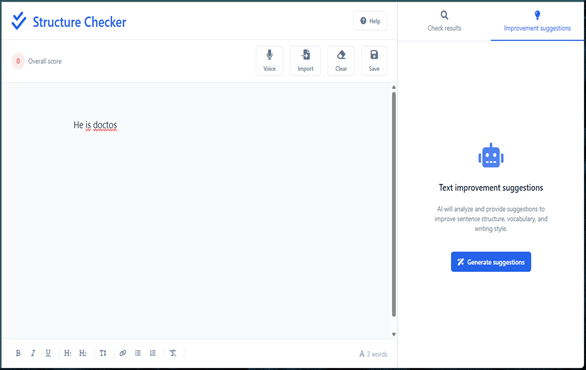
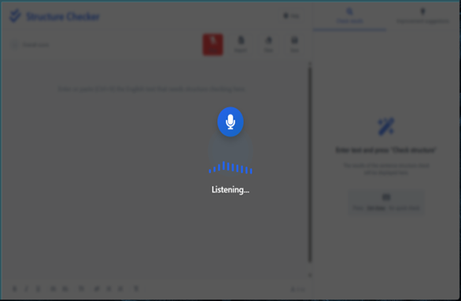
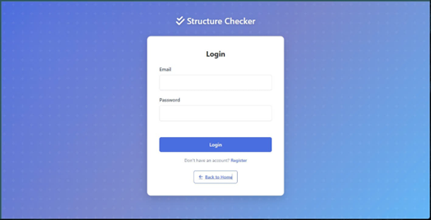
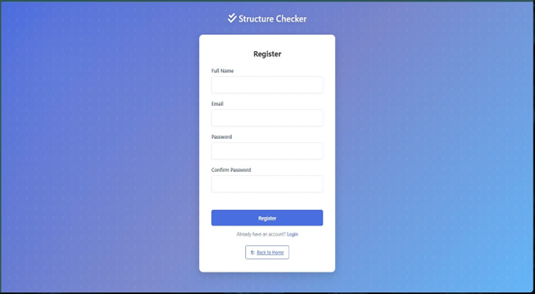

# 🤖 AI-Powered English Grammar Corrector & Syntax Parser

## 💡 Project Overview

**English Grammar Corrector** is a real-time web application (API) leveraging the **T5 Transformer model** to perform syntax parsing and grammar correction. The project demonstrates a complete **DevOps lifecycle**, from containerization with Docker to automated deployment on AWS Cloud using CI/CD pipelines.

| Project Info | Details |
|:--- |:--- |
| **Live Demo** | `http://13.250.168.213/` |
| **Core Model** | T5 Transformer (`grammarly/coedit-large`) |
| **Backend Stack** | Python 3.9, Flask, PyTorch, Hugging Face Transformers |
| **Build Status** |  |

---

## 📸 Product Screenshots

### 1. Core Workflow
Smooth user experience from input to receiving AI analysis results.

| **Smart Editor Interface** | **AI Error Detection** |
|:---:|:---:|
|  |  |
| *Clean, focused editing interface* | *Grammar error detection & Real-time syntax analysis* |

### 2. Advanced Features
Multi-modal input support and intelligent suggestions.

| **AI Suggestions** | **Voice Input Support** |
|:---:|:---:|
|  |  |
| *Natural writing style editing suggestions* | *Speech-to-Text integration* |

### 3. User Management
Secure user management system.

| **Secure Login** | **Registration** |
|:---:|:---:|
|  |  |
| *Secure login with Session Management* | *New user account registration* |

---

## ⚙️ Technical Architecture & Stack

| Category | Tools & Technologies |
|:--- |:--- |
| **Cloud Infrastructure** | **AWS EC2** (t2.micro/t3.micro), **EBS** (Volume Management), **Amazon Linux 2023** |
| **Containerization** | **Docker** (Multi-stage build), **Docker Volumes** (Model Caching) |
| **DevOps & CI/CD** | **GitHub Actions** (Automated Build & Push to Docker Hub), **Nginx** (Reverse Proxy) |
| **Networking & OS** | Security Groups, SSH Tunneling, Linux Administration (Systemctl, Bash Scripting) |

---

## 🧠 Technical Highlights & Problem Solving

This project showcases practical solutions to real-world infrastructure challenges on limited resources (AWS Free Tier):

### 1. Resource Optimization (OOM Killer Mitigation)
- **Challenge:** The `t3.micro` instance (1GB RAM) consistently crashed when loading the 3.13GB T5 Model due to Out-Of-Memory (OOM) errors.
- **Solution:** Implemented a **4GB Swap File** on the Linux filesystem to extend virtual memory, allowing the heavy AI model to run smoothly on a low-cost instance.

### 2. Zero-Downtime Storage Scaling
- **Challenge:** Encountered `no space left on device` error during Docker image pulling (Image size > 8GB).
- **Solution:** Performed **Live EBS Volume Resizing** (8GB → 30GB) and expanded the XFS filesystem (`xfs_growfs`) without stopping the instance.

### 3. Model Caching Strategy
- **Solution:** Utilized **Docker Volumes** to map the Hugging Face cache from the host to the container (`-v /hf_cache:/root/.cache`). This eliminates the need to re-download the 3GB model on every container restart, significantly reducing startup time and bandwidth usage.

### 4. Reverse Proxy Tuning
- **Solution:** Configured **Nginx** as a reverse proxy with extended `proxy_read_timeout` (300s) to handle long-running AI inference requests, preventing 504 Gateway Timeouts.

---
