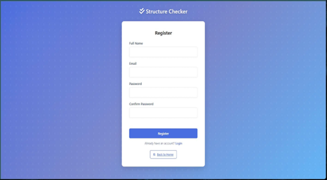
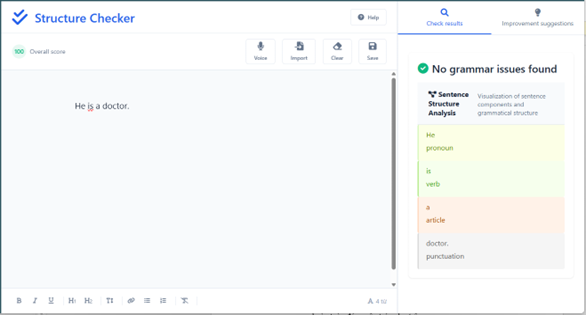
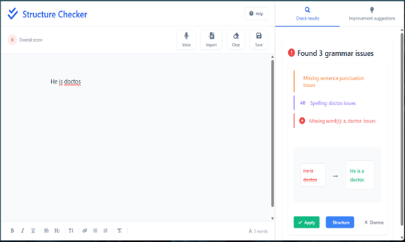

# English Grammar Corrector (hqkiet)

## 📌 Introduction

The **English Grammar Corrector** (hqkiet) is an AI-powered web application designed to help users:

* Automatically detect and correct English grammar errors.
* Improve writing style and sentence structure.
* Store and manage personal correction history.

The system is built upon a Large Language Model (LLM) fine-tuned specifically for the Grammatical Error Correction (GEC) task.

* **Frontend (User):** User-friendly interface with visual comparison between the original text and the corrected version.
* **Backend (Core):** Handles AI model inference, user authentication, and database management.

## 🛠 Tech Stack

* **Core Language:** Python 3.10+, HTML5, CSS3, JavaScript.
* **Web Framework:** Flask.
* **AI & Machine Learning:**
    * PyTorch
    * Hugging Face Transformers
    * Model: CoEdit-Large / T5 (Text-to-Text Transfer Transformer)
* **Database:** SQLite (Stores users and history).
* **Development Tools:**
    * Visual Studio Code
    * Git & GitHub
    * Virtual Environment (venv)

## 📂 Project Structure

* `/models` $\rightarrow$ AI model handling logic (`corrector.py`) and configuration files.
* `/static` $\rightarrow$ Frontend resources (`css/`, `js/`, `images/`).
* `/templates` $\rightarrow$ HTML templates (`index.html`, `login.html`, etc.).
* `/instance` $\rightarrow$ Database file `users.db`.
* `app.py` $\rightarrow$ Main entry point for the Flask application.
* `config.py` $\rightarrow$ System configuration settings.
* `requirements.txt` $\rightarrow$ List of python dependencies.

## 🚀 Features

### User

* **Authentication:** Secure Login / Register functionality.
* **Grammar Correction:** Input text and receive AI-generated corrections instantly.
* **Visual Diff:** Visually compare changes (highlighting errors and fixes) between the input and output.
* **History:** Review past corrections and improved texts.

### System (AI Core)

* Model caching for optimized performance.
* Text tokenization and sequence-to-sequence generation.
* Context-aware evaluation and suggestion.

## 📦 Installation

1.  **Clone the repository:**
    ```bash
    git clone https://github.com/hqkietsoft/final_year_roject
    cd FinalYearProject
    ```

2.  **Set up Virtual Environment** (Recommended):
    ```bash
    python -m venv venv
    # Windows:
    .\venv\Scripts\activate
    # Mac/Linux:
    source venv/bin/activate
    ```

3.  **Install Dependencies:**
    ```bash
    pip install -r requirements.txt
    ```

4.  **Download Model Weights:**
    * *Note:* Since model files (`*.pt`, `*.bin`) are large, they are not stored directly on GitHub.
    * The system uses the Hugging Face `transformers` library. On the first run, it will automatically download the necessary model weights. Please ensure you have a stable internet connection for the first launch.

5.  **Run the Application:**
    ```bash
    python app.py
    ```

6.  **Access:** Open your browser and navigate to `http://127.0.0.1:5000`

## 🖼 Interface Demo

### 1. Login Screen
<p align="center">
  
</p>

### 2. Register Screen
<p align="center">
  
</p>

### 3. Home Page
<p align="center">
  
</p>

### 4. Enter Correctly
<p align="center">
  
</p>

### 5. Enter Incorrectly
<p align="center">
  
</p>

### 5. Enter Incorrectly
<p align="center">
  
</p>

### 5. Enter Incorrectly
<p align="center">
  
</p>
